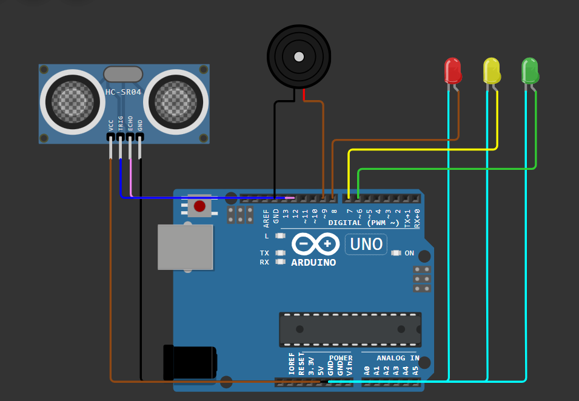

# Smart Parking System using Arduino

A simple smart parking assistance system built with Arduino that measures the distance between a vehicle and nearby obstacles using an HC-SR04 ultrasonic sensor and provides audible feedback to help drivers park safely.

## Features

* Real-time distance measurement
* Obstacle detection using an ultrasonic sensor
* Buzzer alerts with increasing frequency as obstacles get closer
* Simple and low-cost hardware setup

## Components Used

* Arduino Uno
* HC-SR04 Ultrasonic Sensor
* Buzzer
* LEDs
* Jumper Wires

## How It Works

The ultrasonic sensor continuously measures the distance between the vehicle and nearby obstacles.

Based on the measured distance:

1. The Arduino calculates the distance to the obstacle.
3. LEDs indicate safe, caution, or danger zones.
4. The buzzer provides audible feedback that becomes more frequent as the obstacle gets closer.
5. The system continuously updates readings in real time to assist with safe parking.

## Demo Video

[Watch Video](./assets/demo.mp4)

## Live Demo

Test the project here: https://wokwi.com/projects/466828812572581889

## Installation

1. Clone this repository.
2. Open the `.ino` file in the Arduino IDE.
3. Connect the components according to the circuit diagram.
4. Upload the code to the Arduino board.
5. Power the system and begin distance monitoring.

## Circuit Diagram


## Project Structure

```text
Smart Parking System/
├── SmartParkingSystem.ino
├── README.md
└── assets/
```

## Future Improvements

* OLED/LCD graphical interface
* Vehicle counting system
* Multi-sensor parking assistance
* Wireless monitoring via Wi-Fi
* Mobile notifications
* Smart parking slot detection
* IoT dashboard integration